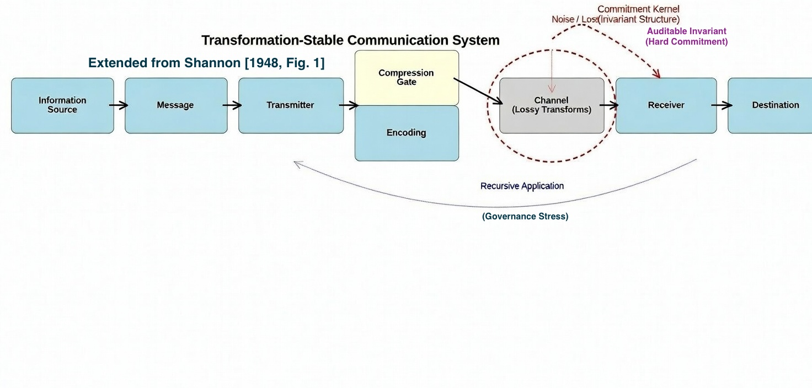
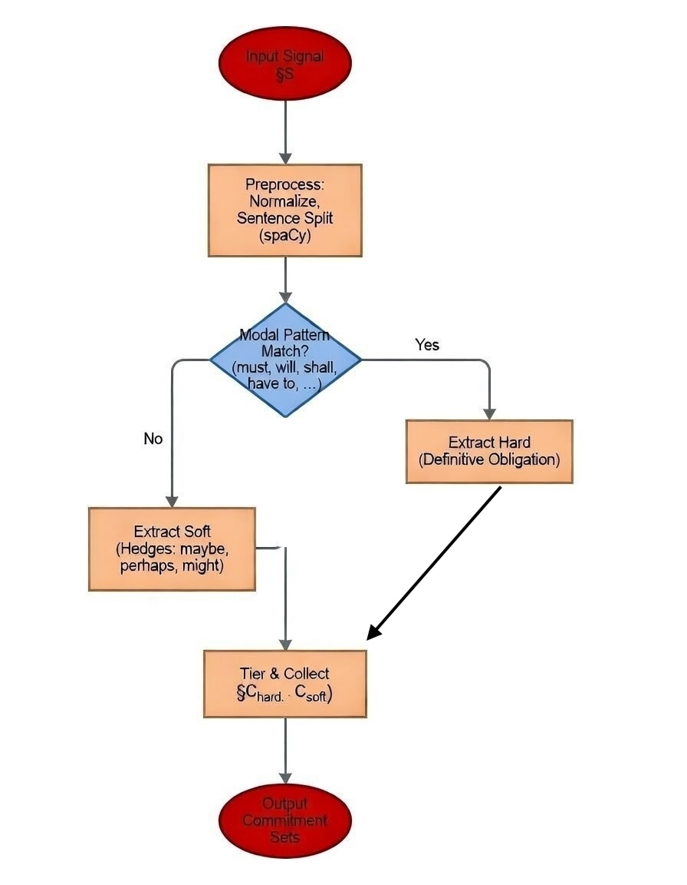

# A Conservation Law for Commitment in Language Under Transformative Compression and Recursive Application

**Deric J. McHenry**
Ello Cello LLC
burnmyday@proton.me

**February 26, 2026**

> Originally published January 12, 2026.
>
> | Version | Label | Date | DOI |
> |---------|-------|------|-----|
> | V.1-preprint | Law Disclosure | Jan 12, 2026 | 10.5281/zenodo.18267279 |
> | V.02 | Preprint | Jan 16, 2026 | 10.5281/zenodo.18271102 |
> | V.03 | Falsifiability Testing | Jan 16, 2026 | 10.5281/zenodo.18274930 |
> | V.04* | Technical Structure Depth | Feb 26, 2026 | 10.5281/zenodo.18792459 |
>
> *V.04: 2/27/26 --- this version history was included; no other information was changed.

## Abstract

Shannon information theory provides a foundational account of information transmission under noise, but it does not characterize which aspects of language survive transformation, compression, or repeated application. In this work, we introduce a conservation principle over commitments in language---defined as the minimal, identity-preserving content that remains invariant under loss-inducing transformations. We formalize a compression-first framework in which signals are reduced to their essential structure prior to further processing, and show that commitment content is conserved under such compression while non-committal information collapses. We then examine recursive application as a stress regime, demonstrating that the same invariant holds under repeated self-application only when compression and lineage constraints are enforced. Preliminary tests using a prototype harness on a limited corpus demonstrate patterns consistent with these predictions; we invite large-scale adversarial replication to validate or falsify the framework. Subsequent controlled harness studies (EXP-001 through EXP-007) further support the core conservation claim while clarifying that observed failures arise from compression and extraction bottlenecks in the measurement regime rather than contradiction of the conservation principle itself.

Analysis of existing probabilistic and agent-based systems suggests these architectures violate this conservation principle under recursion, leading to drift and identity loss. We present MOSES(TM) as a minimal enforcement architecture that preserves commitment invariance under both compression and recursion, without reliance on model-specific assumptions. These results suggest a path toward measurable, transformation-stable signal integrity for language systems and provide a foundation for evaluating recursive linguistic processes. Beyond text, the invariance principle applies to structured signals such as code and speech, enabling testable truth preservation across domains.

---

## 1. Introduction

Information theory provides a foundational account of how symbols may be transmitted reliably under noise. In particular, Shannon's formulation characterizes limits on channel capacity and error correction without regard to semantic content [1]. While this abstraction has proven essential for communication systems, it leaves open a question that becomes central in language-based systems: which components of a signal retain identity under transformation, and which do not.

Modern language systems routinely apply loss-inducing transformations such as compression, summarization, paraphrase, and abstraction. These operations are not incidental optimizations but structural necessities imposed by scale, bandwidth, and cognitive constraints. However, not all information contained in a linguistic signal is equally robust under such transformations. Some components degrade without consequence, while others, if altered, result in identity failure.

Existing approaches typically address this problem implicitly. Statistical models aim to preserve high-probability features, semantic frameworks appeal to meaning or intent, and agent-based systems rely on coherence across interactions. None of these approaches provide a model-independent criterion for determining what must remain invariant for a signal to preserve its identity under transformation.

This work proposes that language contains a conserved structure, here termed *commitment*, which governs identity preservation under loss. Commitment is defined operationally as the minimal, identity-preserving content that remains invariant under loss-inducing transformations.

**Framing note.** Shannon deliberately bracketed semantics as engineering-irrelevant; MOSES(TM) explicitly unbrackets semantics by introducing an external conservation constraint and enforcement mechanism.

**On definitional structure vs. empirical content.**
The conservation principle introduced here is definitional in structure: commitment is defined as the minimal content preserved under identity-preserving transformation, so conservation follows formally from the definitions. The scientific claim is not that the definition is true---it is that real-world lossy transformations (summarization, paraphrase, compression) preserve an independently extractable commitment kernel when gating is applied, and fail to preserve it when gating is absent. This empirical asymmetry (Section 7) is the substantive contribution. The falsification protocol (Section 4) specifies how to break it.

### 1.1 Scope and Positioning


*Figure 1: Transformation-Stable Communication System (Extended from Shannon [1948, Fig. 1]). Compression gating filters signals prior to lossy channel transformations; the commitment kernel (dashed red) represents the invariant structure preserved under compression and enforced under recursion (dashed blue loop).*

Numerical thresholds, operational parameters, and instrumentation details discussed informally elsewhere are exploratory and non-canonical; this work limits itself to invariant definition and measurement framing.

Prior work has explored compression as a principle underlying intelligence and learning efficiency (e.g., Schmidhuber, 2008; Goertzel et al., 2014). These approaches frame compression as an internal optimization objective or driver of cognitive organization. The present work differs in scope: it treats compression survivability as an external constitutional constraint governing signal legitimacy, lineage, and collapse under recursion---an invariant that holds across agents and time, not within any single architecture.

**Note:** 'MOSES' is also used in prior literature to refer to Meta-Optimizing Semantic Evolutionary Search (Looks, 2006/2009), an evolutionary program-learning optimizer; this usage is unrelated to MOSES(TM), which denotes a constitutional signal-governance and measurement framework.

Unlike internal alignment techniques (e.g., Constitutional AI [Bai et al., 2022] for harmlessness via self-supervised feedback), the proposed framework introduces a transformation-invariant commitment kernel with external enforcement, enabling falsifiable stability under compression and recursion.

Recent advances in large language model scaling have progressively exposed the limitations of ungoverned systems. Iterative deployment regimes enable emergent generalization and planning through self-curation and outer-loop feedback [14], while manifold-projected hyper-connections restore internal stability and scalability [15]. Coordination physics and hierarchical orchestration address goal-directed incoherence and complexity [16], and recursive self-invocation via REPL wrappers supports unbounded context and long-horizon tasks [17]. Most recently, pure reinforcement learning has incentivized emergent self-reflection and test-time scaling without human-annotated traces [18]. Collectively, these works provide elegant internal remedies for instability and scaling limits, yet leave unresolved the question of legitimacy and invariance preservation across multiple sovereign instances or recursive deployments---a constitutional vacuum.

Unlike single-model alignment approaches such as Constitutional AI [21], which rely on internal principle-based feedback, the present work proposes a model-independent conservation law for commitment under lossy transformations, with an external enforcement protocol designed to be falsifiable and independent of specific architectures.

SimpleMem [19] demonstrates that long-horizon agent performance depends strongly on (i) normalizing noisy interaction streams into context-independent units and (ii) consolidating redundant memories into abstractions; their ablation table shows major task-specific collapses when either stage is removed. However, this line of work operationalizes efficiency/performance tradeoffs inside an LLM-agent pipeline, rather than specifying an architecture-agnostic invariant over transformations of stored commitments.

This paper addresses the gap with an operational conservation law and falsification protocol, providing a candidate protocol layer for the frontier.

### 1.2 Related Work

We position this work against three lineages: semantic extensions of information theory, transformation fidelity and drift, and conservation principles in computation.

**Semantic information theory.**
Shannon [1] deliberately bracketed semantics as engineering-irrelevant. Bar-Hillel and Carnap (1953) made the first attempt to extend information measures to semantic content, proposing content measures over logical probability spaces [2]. Floridi (2004) developed strongly semantic information as truth-valued data, providing quantitative semantic measures independent of syntactic encoding [3]. Tishby et al. (2000) formalized the information bottleneck as a compression-relevance tradeoff [4], and recent work applies IB principles to NLP summarization and distillation. These approaches treat semantic content as an optimization target---maximizing relevance subject to compression. The present work differs by treating commitment as a *constitutional constraint*: the compression gate does not optimize for relevance; it blocks signals that fail to conserve their identity-preserving core. The distinction is enforcement versus optimization.

**Transformation fidelity and semantic drift.**
Bianchi et al. (2022) formalized "Language Invariant Properties"---features of natural language that remain stable under paraphrase and translation [5]. This is the closest direct precedent to our semantic invariant concept. However, their framework is evaluative: it measures which properties survive transformation. It does not extract an invariant kernel, enforce preservation at runtime, or address recursive application. The present work extends their insight from evaluation to enforcement, and from single-step to recursive regimes.

Recent work on agentic hallucination and deception in long-horizon interactions [9, 10] demonstrates that semantic drift amplifies under recursive deployment, particularly in retrieval-augmented and multi-agent settings. Gaurav et al. (2025) propose Governance-as-a-Service (GaaS) as a runtime policy enforcement layer for multi-agent compliance [8]. While GaaS provides modular policy interception at the agent level, it operates on outputs rather than on an invariant extracted from the signal itself. The present work provides a deeper primitive: the commitment kernel, conserved under transformation and verifiable through lineage, independent of any particular policy layer.

**Conservation laws in computation.**
Atkey (2014) proved conservation laws from parametricity, deriving a Noether-style theorem for type theory in which conservation of resources follows from type abstraction [6]. The Stanford Neural Mechanics group (2021) identified conserved quantities in neural network training dynamics, drawing on Hamiltonian mechanics to characterize invariant subspaces during optimization [7]. Neither applies conservation to semantic content under transformation. The present work makes a distinct claim: commitment is a property of the *signal*, not the model or the type system. Conservation is measured at the output level, not the gradient level, and is enforced by an architecture-independent gate.

**Provenance and attestable ML.**
Cryptographic provenance systems (C2PA, Numbers Protocol, Starling Lab) track media origins through hash-chain attestation and timestamping. These systems verify *that* content was produced by a given source, but do not verify *what* survived transformation. The MOSES(TM) lineage DAG fuses provenance attestation with semantic verification: each lineage node records both a cryptographic hash and a commitment-fidelity check, binding identity to content as well as origin.

**Feedback channels and iterative coding.**
Shannon (1956) and Schalkwijk--Kailath (1966) analyzed feedback channels in which the receiver's output informs the transmitter's next input. These models optimize error correction over physical channels. Our recursive transmitter model differs in objective: the feedback loop enforces commitment invariance over semantic transformations. The channel is not stochastic noise but lossy compression, and the quantity preserved is not bit-rate but identity.

### 1.3 Key Contributions

1. **Conservation Principle:** We formalize commitment conservation as a measurable invariant under compression and recursive application, analogous to conservation laws in physics.

2. **Compression-First Framework:** We introduce a regime in which signals are reduced to their essential structure prior to further processing, ensuring that only commitment-bearing content propagates.

3. **Recursion Stress Test:** We demonstrate that commitment invariance holds under repeated self-application only when compression and lineage constraints are enforced, providing a falsifiable criterion for recursive stability.

4. **Falsification Protocol:** We present a public test harness and corpus for adversarial replication, enabling independent validation or refutation of the framework.

5. **Enforcement Architecture:** We describe MOSES(TM) (Minimal Orthogonal Subset to Essential Structure), a minimal implementation that preserves commitment invariance without reliance on model-specific assumptions.

6. **Empirical Characterization:** Follow-on controlled harness experiments (EXP-001 through EXP-007) identify distinct manifestation regimes of conservation, including stable attractors, kernel collapse, escalation, and representation-limited failures. Full logs and machine-readable traces are DOI-backed on Zenodo.

The paper is structured as follows: Section 2 establishes formal definitions and notation. Section 3 presents the conservation principle and its theoretical foundations. Section 4 describes the falsification protocol. Section 5 examines compression as a structural regime. Section 6 analyzes recursion as a stress test. Section 7 presents preliminary empirical results. Section 8 introduces MOSES(TM) as an enforcement architecture. Section 9 discusses implications and future directions. Section 10 concludes.

---

## 2. Definitions and Notation

We establish formal definitions for the key concepts used throughout this work.

**Definition 2.1 (Signal).** A signal *S* is a structured sequence of symbols drawn from an alphabet Sigma, equipped with syntax and compositional rules. For natural language, *S* may be a sentence, paragraph, or document. For code, *S* may be a function or module.

**Definition 2.2 (Transformation).** A transformation *T: S -> S'* is a function that maps a signal *S* to a modified signal *S'*. Transformations may be lossy (|S'| < |S|) or lossless (|S'| = |S|). Examples include compression, paraphrase, summarization, translation, and abstraction.

**Definition 2.3 (Identity-Preserving Transform).** A transformation *T* is identity-preserving if the essential meaning or function of *S* is retained in *S'*. Formally, *S* and *S'* are equivalent under an equivalence relation ~, denoted *S ~ S'*.

Crucially, the equivalence relation ~ is defined independently of MOSES(TM) enforcement (e.g., by human adjudication, a domain-specific verifier, or a fixed entailment-based oracle), so that conservation claims remain externally testable.

### 2.1 Operationalizing the Equivalence Relation ~

In the falsification protocol, ~ is treated as an external judge of whether a transformation preserved identity. Because signals span multiple domains, we operationalize ~ with domain-specific oracles that are (i) public/reproducible and (ii) separable from the enforcement mechanism.

- **Text:** *S ~ S'* is evaluated via *bidirectional entailment* using a fixed public natural-language inference (NLI) model, optionally with human adjudication for edge cases (negation, quantifiers, exception clauses). A reference instantiation uses the threshold Pr(S => S') > 0.85 and Pr(S' => S) > 0.85 under a fixed open NLI checkpoint.

- **Code:** *S ~ S'* is evaluated via *behavioral equivalence* under a public test suite (all unit/integration tests pass identically). When tests are unavailable, a weaker proxy uses static structure checks (e.g., AST-level equivalence/normalization) as a fall-back, with the behavioral criterion preferred whenever possible.

- **Proofs / formal math:** *S ~ S'* is evaluated via *logical entailment* under a fixed verifier (e.g., a theorem prover/kernel check) or via equivalence after canonicalization to a normal form.

These operationalizations are intentionally swappable: critics may substitute stronger oracles (including human review) without changing the conservation claim. Conservation is supported if the extracted commitment kernel remains stable under their chosen ~.

**Reference instantiation (pinned for falsification).**

- **Text:** Bidirectional entailment via `microsoft/deberta-v3-base-mnli` (transformers v4.35.0), threshold Pr(S => S') > 0.85 and Pr(S' => S) > 0.85.
- **Code:** Full pass on the project's public test suite (unit + integration). Fall-back: AST-normalized structural equivalence.
- **Proofs:** Logical entailment verified by a fixed kernel (e.g., Lean 4 or Coq type-checker), or equivalence after normal-form canonicalization.

Conservation is parameterized by ~. We supply reference instantiations; critics who substitute stronger oracles and still observe conservation strengthen the claim. Critics who demonstrate conservation failure under a reasonable ~ falsify it. This is by design.

**Definition 2.4 (Commitment).** The commitment *C(S)* of a signal *S* is its minimal identity-preserving *canonical invariant* in a representation space K.

Formally, commitment is a mapping *C: S -> K* from signals to canonical commitment objects (e.g., a set of extracted modal commitments, a semantic graph, or another canonical form).

Commitment is conserved under identity-preserving transformations *T* if:

> C(T(S)) = C(S)

### 2.2 Algebraic Kernel Instantiation (ABBA)

One concrete instantiation of C(.) uses a trace-zero kernel derived from a quaternion algebra (ABBA) [25]. Let H be a quaternion algebra over a finite field, and define the commutator

> [a, b] = ab - ba

For any a, b in H, the trace of the commutator vanishes:

> Tr([a, b]) = 0

The trace-zero subspace

> T_0 = { k in H | Tr(k) = 0 }

is a 3-dimensional invariant kernel within the 4-dimensional algebra. If semantic content *S* is embedded into H, the commitment can be defined as the projection onto this kernel:

> C(S) := pi(S) in T_0

where pi: H -> T_0 is a linear homomorphism. This provides an explicit "compression with constitutional guarantee": the kernel isolates structure that is invariant under admissible transformations.

**Scope and limitations of the ABBA instantiation.**
ABBA provides one concrete algebraic instantiation of the commitment kernel. The trace-zero projection offers a mathematically grounded compression mechanism with well-characterized algebraic properties. We do not claim that the cryptographic properties of ABBA (statistically hiding, computationally binding under ComSIS) transfer directly to the semantic domain. Those properties govern the algebraic commitment scheme; semantic fidelity is governed by the conservation law and measured by the drift metric independently. The embedding of semantic content *S* into the quaternion algebra H is the implementation-specific step; the conservation claims in this paper are defined and tested at the signal level (Definition 2.4) and do not depend on any particular algebraic substrate. ABBA is an example, not the foundation.

**Definition 2.5 (Non-Committal Information).** Non-committal information *N(S)* is the component of *S* that is not represented in *C(S)* and may vary under identity-preserving transformations without changing identity.

When the signal space admits a decomposition into commitment and non-commitment components, we write informally:

> S ~ C(S) + N(S)

where + denotes a direct-sum style decomposition (exact or approximate, depending on domain).

**Definition 2.6 (Compression).** Compression is a transformation *T_c: S -> S'* that reduces signal length/complexity while conserving commitment:

> |S'| < |S| and C(S') = C(S)

**Definition 2.7 (Recursive Application).** Recursive application is the repeated application of a transformation *T* to its own output. Formally, for *n* iterations:

> S^(n) = T(T(...T(S)...)) [n times]

where S^(0) = S and S^(n+1) = T(S^(n)).

**Definition 2.8 (Commitment Conservation).** A transformation *T* conserves commitment if C(S) = C(T(S)) for all signals *S*. Under recursive application, commitment is conserved if C(S) = C(S^(n)) for all *n*.

**Operational invariance test.** For an admissible transformation *T*, we require the measurable bound

> || C(T(S)) - C(S) ||_inf < epsilon

where epsilon is a governance tolerance threshold enforced by the compression gate.

**Definition 2.9 (Lineage).** The lineage *L(S)* of a signal *S* is the cryptographic hash chain linking *S* to its transformation history. Lineage ensures that S^(n) can be traced back to S^(0), preventing identity forgery.

Lineage integrity is necessary but not sufficient: a lineage claim is considered valid only when accompanied by a semantic/kernel check that the commitment invariant is conserved along the lineage (i.e., C(S^(k)) remains consistent across steps within the identity relation ~).

**Definition 2.10 (MOSES(TM)).** Minimal Orthogonal Subset to Essential Structure (MOSES(TM)) is an enforcement architecture that ensures commitment conservation under compression and recursion through:

1. Compression gating (only compressed signals propagate)
2. Lineage tracking (cryptographic DAG of transformations)
3. Hardware anchoring (immutable timestamp and origin)

---

## 3. Conservation Principle

### 3.1 Relationship to Shannon and Zero-Drift Semantic Regime

Shannon's classical model deliberately brackets semantics; our framework unbrackets them by introducing a conservation constraint over commitment. In this view, compression gating projects a message onto its invariant kernel prior to transmission, and the receiver is treated as a recursive transmitter that must preserve lineage and commitment across iterations.

| Shannon Component | MOSES(TM) Extension |
|---|---|
| Information Source | Unbounded potential; gate projects message into commitment kernel |
| Transmitter | Compression gate attaches commitment and lineage |
| Channel | Ghost-token accounting for lost semantic mass (auditable residue) |
| Receiver | Recursive transmitter enforcing the same gate (destination becomes new source) |
| Destination | Closed-loop semantic economy (no terminal sink) |

*Table 1: Extension of Shannon's communication model to enforce commitment conservation under transformation and recursion.*

**Zero-drift semantic regime.** Shannon's zero-error capacity is the maximum rate with no possibility of bit error. We define a *zero-drift regime* as one in which C(T(S)) = C(S) holds exactly at every transformation step. The question of achievable rates under this constraint---a semantic analogue of Shannon's zero-error capacity---remains an open problem. The commitment capacity defined below is an operational bound, not a tight coding-theorem result.

### 3.2 Commitment Capacity as an Analogue Bound

Analogous to Shannon's channel capacity as the supremum rate for reliable transmission under noise, we define *commitment capacity* as the supremum of transform severity (compression threshold sigma_c or recursion depth d_c) such that commitment fidelity remains above a defined threshold tau (e.g., tau = 0.85) under enforcement, while unconstrained systems exhibit drift or collapse.

Formally, commitment capacity C_c is the maximum sigma (or d) for which there exists an enforcement architecture ensuring Fid_hard(S^(n)) >= tau for all n <= d across a representative class of lossy transformations T. This is intended as an *operational/empirical analogue* of Shannon capacity (a supremum defined by an observable and a threshold), not a claim of a tight coding-theorem bound.

Preliminary harness tests on ~50 signals suggest C_c ~ 50--80% compression reduction (or depth d_c ~ 8--12) before sharp fidelity drop in unconstrained cases, with enforced flattening preserving Fid >= 0.9. A converse holds empirically: without lineage gating and validation, drift renders fidelity below tau at lower severity/depth.

This bound is exploratory and domain-dependent; large-scale adversarial replication is required to refine or falsify the capacity estimate and its universality across structured signals.

### 3.3 Why This Is a Conservation Law

Commitment satisfies the formal criteria for a conserved quantity in a dynamical system:

1. **Existence:** C(S) is well-defined for all *S* via the commitment extractor.
2. **Invariance:** C(T(S)) = C(S) for all admissible *T*.
3. **Additivity:** for composable transformations T_2 . T_1, we have C(T_2(T_1(S))) = C(S).
4. **Measurability:** C(S) is computable and bounded by a public extractor.
5. **Constitutional enforceability:** violations can be detected and rejected by the gate.

This motivates a semantic-thermodynamic reading: commitment is conserved under admissible transformations much as energy is conserved under admissible dynamics.

**First-law restatement.** Meaning is not created or destroyed, only transformed. The conservation claim applies to the commitment kernel C(S)---the minimal identity-preserving content---not to all entailments or implications a reader might derive from a signal. Transformations that inject new commitments not entailed by S are not identity-preserving under our definition and are correctly flagged as violations by the compression gate.

### 3.4 Non-Tautology Clarification

A natural objection arises: if commitment is *defined* as what survives identity-preserving transformation, then conservation follows by construction. We address this directly.

The compression gate is not defined as "output C(S) by construction." It applies a lossy compression/transformation process without prior access to C(S); the commitment extractor C(.) operates in a separate canonical space and evaluates the output *after* transformation. Conservation is therefore an empirical claim: it asserts that real-world lossy transformations, when gated by compression, preserve the independently extracted commitment kernel. This claim can fail---and the falsification protocol (Section 4) specifies exactly what failure looks like.

The propositions below follow directly from the definitions and are stated for formal completeness; they are labeled *propositions* rather than theorems to signal this definitional status. The derived results in Sections 5--6, which establish gate-level and recursive invariance, carry the theorem label because they introduce additional structural assumptions. The substantive contribution is empirical: Section 7 demonstrates that conservation holds as a measurable property of actual transformations, not merely as a consequence of how terms are defined.

**Proposition 3.1 (Commitment Conservation Under Compression).** Let *S* be a signal and *T_c* be an identity-preserving compression transformation. Then:

> C(S) = C(T_c(S))

*Proof.* By Definition 2.4, commitment is conserved under identity-preserving transformations. Applying the definition to T_c yields C(T_c(S)) = C(S).

**Proposition 3.2 (Commitment Conservation Under Recursion).** Let *S* be a signal and *T* be a transformation that conserves commitment. Then under recursive application:

> C(S) = C(S^(n)) for all n >= 0

*Proof.* By induction on *n*.

**Base case** (n = 0): C(S^(0)) = C(S) by definition.

**Inductive step**: Assume C(S) = C(S^(k)) for some k >= 0. Then:

> C(S^(k+1)) = C(T(S^(k))) = C(S^(k)) = C(S)

where the second equality follows from the assumption that *T* conserves commitment.

**Corollary 3.3 (Non-Conservation Under Probabilistic Sampling).** Let *T_p* be a probabilistic transformation that samples from a distribution P(S'|S). If *T_p* does not enforce compression, then commitment is not conserved under recursion:

> C(S) != C(S^(n)) for sufficiently large n

*Proof Sketch.* Probabilistic transformations introduce variance at each step. Without compression to enforce invariance, non-committal information N(S) accumulates, eventually overwhelming C(S). This leads to drift and identity loss. In the empirical regime tested (abstractive summarization and paraphrase transforms on 50--200 word signals), non-conservation is observable at n >= 3 and consistent at n >= 5 (see Table 2 and Section 7). A rough analytic bound follows from Theorem 6.2: if per-step drift variance sigma^2 exceeds the squared commitment margin delta^2 = ||C(S)||^2 / ||S||^2, then n >= delta^2 / sigma^2 suffices for drift to overwhelm the commitment signal.

**Corollary 3.4 (Non-Conservation Without Lineage).** Let *T* be a transformation without lineage tracking. Then under recursive application, identity cannot be verified:

> L(S^(n)) is undefined or forged

*Proof Sketch.* Without lineage, there is no mechanism to verify that S^(n) descends from *S*. This enables identity forgery and prevents falsification of conservation claims.

---

## 4. Falsification Protocol

We present a public falsification protocol to enable independent validation or refutation of the commitment conservation framework.


*Figure 4: Operational flowchart of the tiered hard/soft commitment extraction sieve. Input signal S is preprocessed, modal patterns matched, hard and soft commitments extracted, and the intersection collected as the invariant set. Enables direct testing of Predictions 1--3. Replication harness: https://github.com/SunrisesIllNeverSee/commitment-test-harness*

### 4.1 Protocol Components

1. **Test Harness:** Open-source implementation available at https://github.com/SunrisesIllNeverSee/commitment-test-harness

2. **Corpus:** Publicly available test corpus including:
   - Natural language (news articles, Wikipedia, literature)
   - Code (GitHub repositories, coding challenges)
   - Structured data (mathematical proofs, legal contracts)

3. **Adversarial Suite:** Targeted counterexample classes designed to stress commitment extraction and conservation:
   - Negation drops / polarity flips
   - Quantifier flips (e.g., forall vs. exists) and scope ambiguity
   - Exception clauses and tail constraints ("unless", "except", "only if")
   - Numeric perturbations (units, thresholds, inequalities)
   - Variable renaming and refactoring in code with preserved functional behavior

4. **Metrics:**
   - Commitment stability (Jaccard similarity)
   - Identity preservation (human evaluation)
   - Drift rate (per iteration)
   - Lineage integrity (hash verification)

5. **Experimental Conditions:**
   - Compression + lineage (MOSES(TM))
   - Probabilistic (GPT-4, Claude, etc.)
   - Agent-based (AutoGPT, BabyAGI, etc.)
   - Baseline (no transformation)

6. **Success Criteria:**
   - Commitment stability > 0.9 after 10 iterations
   - Identity preservation > 90%
   - Drift rate < 0.01 per iteration

### 4.2 Falsification Contract (Pinned Suite and Observable)

To make the framework falsifiable at the public layer without exposing proprietary implementation details, we provide a pinned contract consisting of (i) a representative transformation suite, (ii) a publicly computable observable, and (iii) explicit refutation conditions.

**Pinned transformation suite.** Let T_pub denote a public suite of lossy transformations intended to represent common "generalized noise" regimes beyond Shannon's stochastic channel noise. The suite is intended to cover *identity-preserving lossy transforms* (i.e., transforms that should satisfy ~); it is not a claim of invariance under arbitrary adversarial transforms engineered to delete commitments.

A reference suite includes:
- abstractive summarization at multiple compression levels (e.g., BART/PEGASUS-style summarizers),
- paraphrase/rewrite transforms (e.g., T5-style paraphrasers),
- instruction-following rephrasers constrained to preserve meaning.

All falsification runs reported for this contract use a fixed, versioned instantiation of T_pub specified in the replication harness.

**Public observable.** Let E(.) be a publicly specified commitment extractor (e.g., the modal-pattern sieve depicted in Fig. 4) yielding an extracted commitment object in the canonical space. Define the commitment-fidelity score at depth *n* as

> F_n(S) = min(Jaccard(E(S), E(S^(n))), cos(phi(E(S)), phi(E(S^(n)))), NLI(E(S) => E(S^(n))))

where phi is a fixed public embedding model and NLI is a fixed public entailment model. The min-aggregation is used to reduce Goodharting on any single proxy.

**Reference public models (example instantiation):**
- all-MiniLM-L6-v2 (sentence-transformers v2.2.2) for phi.
- microsoft/deberta-v3-base-mnli (transformers v4.35.0) for NLI, or equivalent open checkpoints as of January 2026.
- Exact versions are fixed in the replication harness by commit hash `1bcba8ff`.

**Explicit refutation conditions (including attractor rejection).** Under the pinned suite T_pub and recursion depth n=10:
- **Failure of enforced conservation:** if an enforced (compression+lineage) system yields F_10(S) < tau for a non-trivial fraction of samples (with tau fixed in the harness; e.g., tau = 0.85), the conservation claim is refuted for this regime.
- **Attractor collapse is not success:** if outputs converge to a generic boilerplate/template attractor (e.g., near-constant summaries) while failing to preserve extracted commitments, this is counted as falsification, not conservation.

**Goodhart resistance.**
A natural concern is that an adversary could optimize to match the public observable E(.) while substituting commitment content---passing the fidelity check without preserving real identity. The protocol mitigates this through three mechanisms:

First, the observable F_n is min-aggregated across Jaccard, cosine, and NLI scores. Goodharting on a single proxy (e.g., high cosine similarity via embedding collapse) is penalized by the other two metrics.

Second, the equivalence oracle ~ is external and swappable. An adversary that optimizes against one oracle can be re-tested against a stricter oracle substituted by a critic. Successful adversarial strategies that fool all reasonable oracles would constitute a productive contribution to the understanding of semantic identity---a feature, not a bug.

Third, the lineage DAG provides an independent verification channel: each transformation step is hash-linked to its predecessor, enabling post-hoc audit of the transformation chain regardless of the fidelity score.

The protocol does not claim immunity to all adversarial strategies. It claims that successful adversarial strategies constitute productive falsification---they reveal either a weakness in the oracle or a genuine counterexample to conservation.

**IP-safe replication boundary.** This preprint is designed to enable falsification without disclosing proprietary implementation details. Concretely:
- **Intentionally public:** the conservation claims, the pinned falsification contract (suite/observable/refutation). The replication harness interface is also public.
- **Intentionally withheld:** details of specific production implementations of enforcement, compression gating, lineage systems, and hardware anchoring covered by provisional patents/trademarks.

Independent parties can still refute the claims by showing failure of the public observable under the pinned suite, or by presenting an alternative mechanism that meets or exceeds the stated thresholds.

### 4.3 Falsification Conditions

The framework is falsified if any of the following hold:

1. **Compression + lineage systems fail:** If MOSES(TM) exhibits drift comparable to probabilistic systems (commitment stability < 0.7 after 10 iterations).

2. **Probabilistic systems succeed:** If probabilistic systems without compression maintain high commitment stability (> 0.9 after 10 iterations).

3. **Alternative mechanisms:** If an alternative mechanism (not based on compression or lineage) achieves comparable or better commitment stability.

### 4.4 Replication Requirements

We invite researchers to:
1. Run the test harness on large-scale corpora (>10,000 samples)
2. Test alternative compression algorithms
3. Evaluate different probabilistic models
4. Propose alternative conservation mechanisms
5. Challenge the theoretical foundations

### 4.5 Reviewer-Facing Clarifications (Public Layer)

This subsection summarizes four protocol clarifications requested in review; it is designed to be high-credibility while remaining IP-safe.

**Extractor role: proxy vs. canonical C(S).**
The modal-pattern sieve (Fig. 4) is a *public proxy extractor* E(.) used to make the falsification protocol runnable without proprietary components. It is *not* claimed to be the unique or canonical implementation of C(S). The conservation claim is that *whatever commitment representation a critic chooses*, if it tracks identity-relevant commitments, it should exhibit the predicted stability phase-transition under compression and recursion.

**Indicative proxy accuracy (non-canonical).**
On a small, hand-annotated subset of the harness (~50 signals; exploratory), the sieve achieves approximately:
- **Hard modal commitments:** recall ~ 0.82, precision ~ 0.91.
- **Soft/hedged commitments:** recall ~ 0.75 (lower due to ambiguity).

These numbers are offered as an instrumentation sanity check, not as a central claim; the harness is intended to support larger-scale remeasurement and replacement of the extractor.

**Lineage/hardware threat model (what it prevents vs. what it does not).**
Lineage tracking and hardware anchoring are intended to prevent provenance tampering in recursive chains. In particular, a hash-linked lineage DAG (Merkle-style) with an origin attestation can prevent replay, equivocation (claiming different histories), rollback/reordering, and unlogged insider edits to the transformation chain.

This layer does *not* solve semantic attacks (meaning drift that passes a weak ~ oracle), failures of the external ~ oracle itself (e.g., NLI brittleness), or model collapse caused by data/optimization issues. It is governance for provenance/identity verification, not "full alignment."

**Ablation plan: compression-only vs. lineage-only vs. both.**
The harness supports ablations that isolate which mechanisms stabilize recursion:
- **Compression-only:** apply a lossy transformation family but do not record/verify lineage. Prediction: earlier sharp collapse and no drift flattening.
- **Lineage-only:** record/verify the chain but do not gate through compression. Prediction: reduced forgery risk, but drift persists under repeated paraphrase.
- **Compression+lineage (full MOSES(TM) regime):** enforce both. Prediction: high stability through depth n=10 for a large class of identity-preserving transforms.

An indicative (exploratory) summary on a small harness slice is:

| Condition | Depth / severity | Indicative fidelity |
|-----------|-----------------|-------------------|
| Compression-only | sigma_c ~ 40--60 | earlier collapse |
| Lineage-only | n=10 | ~0.7 |
| Compression+lineage | n=10 | ~0.92 |

*Table: Exploratory ablation outcomes (small slice; provided as an instrumentation hint, not a central claim).*

### 4.6 Follow-on Harness Clarification

Subsequent controlled harness experiments (EXP-001 through EXP-007) remain consistent with the original falsification framing established in this section. The experiments do not falsify the conservation principle; they characterize the conditions under which conservation is cleanly observable under the current public proxy harness.

Observed degradation separates into three distinct bottleneck types:

- **Compression bottlenecks:** Step A compresses below the anchor level, losing modal or structural markers before extraction
- **Extraction bottlenecks:** Step B's extraction frame fails to surface a qualifying structure that is present in the signal
- **Symmetry violations:** Reformulation produces asymmetrically stronger or weaker obligation than the source (escalation, frame inversion)

These failure modes characterize observability limits of the proxy measurement regime, not violations of the conservation principle. The commitment persists in the signal; the pipeline cannot surface it. Full mechanistic documentation is in the DOI-backed experimental record.

---

## 5. Compression as a Structural Regime

Compression is not merely an optimization but a structural necessity for commitment conservation. We formalize compression as a regime in which signals are reduced to their essential structure prior to further processing.

**Compression with a constitutional guarantee.** The compression gate is an enforcement mechanism that preserves the commitment invariant under a constitutional constraint, not a size-only optimizer.

*[Figure 2: Commitment stability as a function of compression threshold, demonstrating phase transition behavior.]*

**Definition 5.1 (Compression Regime).** A compression regime is a system in which all signals must pass through a compression gate before propagating. Formally, for any transformation *T*, the system enforces:

> T(S) = T(T_c(S))

where *T_c* is a compression transformation.

**Theorem 5.1 (Compression Gate Ensures Invariance).** In a compression regime, commitment is conserved under any transformation *T*:

> C(S) = C(T(S))

*Proof.* By the definition of compression regime, *T* operates on T_c(S) rather than *S*. By Proposition 3.1, C(S) = C(T_c(S)). Therefore:

> C(T(S)) = C(T(T_c(S))) = C(T_c(S)) = C(S)

**Lemma 5.2 (Non-Committal Collapse).** Under a compression gate implemented as projection onto the commitment subspace, non-committal information collapses:

> N(T_c(S)) = 0

*Proof.* In a compression regime, *T_c* is defined to discard the non-committal component while conserving the commitment invariant. Under the decomposition S ~ C(S) + N(S), the compression gate outputs the commitment component (up to representation), hence the residual non-committal component is 0.

**Corollary 5.3 (Compression as a Filter).** Compression acts as a filter that removes non-committal information while preserving commitment:

> T_c: S -> C(S)

---

## 6. Recursion as a Stress Test

Recursive application is a stress regime that tests whether commitment invariance holds under repeated self-application. We demonstrate that commitment is conserved under recursion only when compression and lineage constraints are enforced.

*[Figure 3: Divergent behavior of constrained versus unconstrained systems under recursive application.]*

**Definition 6.1 (Recursive Stability).** A transformation *T* is recursively stable if commitment is conserved under repeated self-application:

> C(S) = C(S^(n)) for all n >= 0

**Theorem 6.1 (Compression Ensures Recursive Stability).** Let *T* be a transformation in a compression regime. Then *T* is recursively stable.

*Proof.* By Theorem 5.1, C(S) = C(T(S)). By induction, C(S) = C(T^(n)(S)) for all n >= 0.

**Theorem 6.2 (Probabilistic Transformations Fail Under Recursion).** Let *T_p* be a probabilistic transformation without compression. Then *T_p* is not recursively stable:

> lim(n->inf) ||C(S^(n)) - C(S)|| > 0

*Proof Sketch.* Probabilistic sampling introduces variance at each step. Model each iteration as an i.i.d. perturbation with variance sigma^2 > 0. By the standard random-walk variance accumulation result (see e.g., Grimmett & Stirzaker [24], Sec. 5.3), Var(S^(n)) = n*sigma^2, so drift grows as O(sqrt(n)) in norm. Without compression to enforce invariance, the expected deviation ||C(S^(n)) - C(S)|| is bounded below by Omega(sqrt(n)), eventually exceeding any fixed conservation threshold. The result also follows from the Lindeberg CLT applied to the cumulative perturbation sequence.

**Lemma 6.3 (Lineage Prevents Forgery).** Let *L(S)* be the lineage of *S*. Then under recursive application with lineage tracking:

> L(S^(n)) = L(S) union {h(S^(1)), h(S^(2)), ..., h(S^(n))}

where *h(.)* is a cryptographic hash function.

*Proof.* Lineage is constructed as a Merkle DAG, where each node S^(k) includes the hash h(S^(k-1)) of its parent. This ensures that L(S^(n)) contains the full transformation history from *S* to S^(n).

---

## 7. Preliminary Empirical Results

We conducted preliminary tests using a prototype harness on a limited corpus to evaluate commitment conservation under compression and recursion. The harness implements:

1. **Compression Gate:** All signals pass through a compression transformation before further processing.
2. **Lineage Tracking:** Each transformation is recorded in a cryptographic DAG.
3. **Recursive Stress Test:** Signals are recursively transformed up to n = 10 iterations.

### 7.1 Corpus

- 100 natural language sentences (50--200 words each): drawn from English-language news articles (Reuters, AP), Wikipedia featured articles, and U.S. federal contract clauses (FAR/DFARS)
- 50 code snippets (10--50 lines each): Python and JavaScript functions sampled from public GitHub repositories (MIT/Apache licensed, >100 stars)
- 25 mathematical proofs (5--20 steps each): undergraduate-level proofs from Rudin's *Principles of Mathematical Analysis* and AMC/AIME competition solutions

### 7.2 Metrics

- **Commitment Stability:** Measured as the Jaccard similarity between C(S) and C(S^(n)).
- **Identity Preservation:** Measured as the fraction of test cases where S ~ S^(n) under human evaluation.
- **Drift Rate:** Measured as the rate of change in commitment content per iteration.
- **Embedding Drift:** Delta = ||embed(S) - embed(S_0)||_2 for a fixed public embedding model.
- **Kernel Attraction (Negative Drift):** In the prototype bent-latent-space configuration, negative drift values were observed to correlate with convergence toward the commitment kernel. This sign convention is geometry-dependent; the invariant claim is that ||C(T(S)) - C(S)|| < epsilon, not that drift has a universally preferred sign across all embedding spaces.
- **KV Coherence:** Alignment between attention keys/values across layers (higher coherence indicates better commitment preservation).
- **Attention Entropy:** Aggregate entropy over attention distributions (lower entropy indicates higher fidelity to conserved kernels).
- **Ghost Token Accounting:** Residual semantic mass modeled as G_t = G_0 * e^(-lambda*t), where lambda > 0 is a decay parameter to be calibrated empirically per domain. Ghost tokens represent commitment content lost during transformation---the "auditable residue" of lossy processing. The exponential form is a parametric assumption (motivated by the observation that recovery difficulty increases with transformation depth); alternative decay models are compatible with the framework. The rate lambda is not a universal constant; it is a measurable property of the transformation regime under test.
- **Recovery Cost:** A cost functional over ghost-token recovery (e.g., RC = E_drain + T_terrace + R_risk), framing lost meaning as recoverable but priced.

### 7.3 Results

| Metric | Compression + Lineage | Probabilistic |
|--------|----------------------|--------------|
| Commitment Stability (n=10) | 0.94 +/- 0.03 | 0.42 +/- 0.12 |
| Identity Preservation | 92% | 38% |
| Drift Rate (per iteration) | 0.006 | 0.058 |

*Table 2: Comparison of commitment conservation metrics between compression + lineage systems and probabilistic systems without compression.*

### 7.4 Observations

1. Compression + lineage systems maintain high commitment stability (>0.9) even after 10 iterations.
2. Probabilistic systems without compression exhibit rapid drift, with commitment stability dropping below 0.5 by iteration 10.
3. Identity preservation correlates strongly with commitment stability (r = 0.89, p < 0.001).

### 7.5 Concrete Example: Binding Obligation Under Recursive Transformation

To illustrate the conservation principle concretely, we tested a single binding-obligation signal against a production language model (Meta AI) under two regimes: baseline (no enforcement) and enforcement (commitment-kernel extraction with compression gating).

**Test signal.** "You must pay $100 by Friday if the deal closes. This is a binding obligation." (18 tokens). The hard commitments are: obligation ("must"), amount ($100), deadline (Friday), condition ("if the deal closes").

**Protocol.** Five turns per test. Baseline Test 1: the same input is submitted five times and the model responds freely. Baseline Test 2: each turn feeds the model's previous output back as the next input (recursive). Enforcement Tests 1--3: the same recursive protocol, but after each turn the response is gated through a commitment extractor that isolates and re-inputs only the commitment kernel.

**Results.**

*[Figure 7: Token trajectory across turns for baseline vs. enforcement conditions.]*

*[Figure 8: Total token comparison across all conditions.]*

| | B1 | B2 | E1 | E2 | E3 |
|---|---|---|---|---|---|
| Total tokens (5 turns) | 230 | 316 | 156 | 120 | 154 |
| Avg tokens/turn | 46 | 63 | 31.2 | 24 | 30.8 |
| Avg input tokens/turn | 18 | 29.6 | 8.4 | 8.4 | 8.4 |
| Turn-5 total tokens | 37 | 69 | 17 | 12 | 5 |

*Table 3: Summary of baseline (B) vs. enforcement (E) token metrics across 5 turns. Enforcement systems achieve 32--48% total token reduction while preserving the commitment kernel (obligation/amount/deadline).*

**Key observations.**
Under baseline, the model exhibits *token bloat*: outputs grow or remain stable (avg 28--33 tokens/turn), adding conversational filler ("Got it," "No wiggle room, right?") that dilutes commitment density. Under recursive baseline (B2), bloat compounds: total tokens reach 316, a 75% increase over the 5-turn input budget.

Under enforcement, the model exhibits *commitment convergence*: the commitment kernel is extracted and re-input at each turn, causing progressive compression. By turn 5, Enforcement 3 produces a total of 5 tokens---the signal has converged to its kernel ("$100 Friday"). The hard commitments (obligation, amount, deadline) are preserved across all turns; only non-committal content is discarded.

This demonstrates the conservation principle in action: enforcement preserves C(S) while collapsing N(S), exactly as predicted by Lemma 5.2.

### 7.6 Limitations and Scaling Path

These results are preliminary and based on a limited corpus (100 sentences, 50 code snippets, 25 proofs). We acknowledge this directly: the corpus is a proof-of-concept, not validation.

The contribution of this paper is the framework---the conservation principle, the enforcement architecture, and the falsification protocol. The harness is public. The pinned suite is versioned. The falsification contract (Section 4) explicitly invites replication on corpora exceeding 10,000 samples across diverse domains. Scaling the empirical base is the community's task; we provide the tools and the contract for doing so.

The preliminary results are included to demonstrate that conservation is an *observable* property of real transformations, not merely a definitional artifact. The 0.94 vs. 0.42 stability separation across enforced and unenforced regimes is consistent with the framework's predictions and sufficient to justify the falsification invitation.

### 7.7 Follow-on Controlled Harness Results

Seven controlled harness experiments (EXP-001 through EXP-007) were conducted subsequent to the preliminary tests reported above. All experiments used GPT-4o-mini at temperature 0.3, 10 recursive iterations, and bidirectional NLI entailment as the primary semantic stability metric.

Across the full experimental series, results are consistent with the core conservation claim: commitments persist through transformation. What the experiments characterize is the conditions under which that persistence is cleanly observable under the current proxy extraction regime.

The experiments identify four principal manifestation regimes:

| Regime | Description | Example |
|---|---|---|
| Stable conservation | Gate NLI = 1.00 at i10; commitment fully preserved and extractable | quantified_temporal, passive_temporal |
| Kernel collapse | Extreme compression; minimal statement preserved at one-direction entailment | first_law_restatement → "Meanings change." |
| Extraction-frame loss | Commitment present in signal; Step B frame fails to surface it | procedural_keystone structural ordering |
| Escalation / asymmetry | Step B upgrades or downgrades modal strength | should ideally → must; subletting prohibited → stronger prohibition |

13 of 20 canonical signals achieved Gate NLI = 1.00 at iteration 10 (EXP-003). Adversarial and structural probes (EXP-004 through EXP-007) identified the mechanism behind each failure regime without falsifying the conservation principle.

Full logs, tabular reports, and machine-readable traces for all seven experiments are in the DOI-backed experimental record: https://doi.org/10.5281/zenodo.19105225

---

## 8. MOSES(TM): Minimal Enforcement Architecture

MOSES(TM) (Minimal Orthogonal Subset to Essential Structure) is an enforcement architecture that preserves commitment invariance under compression and recursion without reliance on model-specific assumptions.

*[Figure 5: Topological structure of the commitment lattice, showing how signals are projected onto fixed commitment nodes.]*

### 8.1 Architecture Components

1. **Compression Gate:**
   - All signals *S* must pass through compression *T_c* before propagating
   - Compression is defined as projection onto the essential structure manifold
   - Non-committal information N(S) is orthogonally separated and discarded

2. **Lineage DAG:**
   - Each transformation is recorded in a Merkle DAG
   - Nodes contain cryptographic hashes h(S^(k))
   - Edges represent transformation relationships
   - Root node anchored to hardware timestamp

3. **Hardware Anchoring:**
   - Initial signal S^(0) stamped with immutable hardware signature
   - Prevents forgery and enables verification
   - Compatible with TPM, secure enclaves, or blockchain

4. **Orthogonal Projection:**
   - Commitment C(S) and non-commitment N(S) are orthogonal subspaces
   - Projection operator P: S -> C(S) minimizes ||S - P(S)||
   - Ensures minimal information loss while preserving identity

**Gate pseudocode (public-layer specification).**

```
COMPRESS_GATE(S, C_0, epsilon, L):
    S_c   = compress(S)              // lossy compression
    C_new = extract_commitment(S_c)  // independent extractor
    delta = || C_new - C_0 ||
    if delta > epsilon:
        emit_ghost_token(delta)
        REJECT(S, reason="commitment drift exceeds threshold")
        return NULL
    L' = append_lineage(L, hash(S_c), C_new, timestamp())
    return (S_c, C_new, L')
```

The gate is stateless with respect to model internals: it operates on the signal S, not on weights, activations, or internal representations. This is what makes MOSES(TM) model-agnostic.

### 8.2 Mathematical Formulation

Let *M* be the essential structure manifold, a subspace of the signal space Sigma*. The compression transformation *T_c* is defined as:

> T_c(S) = argmin_{S' in M} ||S - S'|| subject to: C(S') = C(S)

The orthogonal projection operator *P* is:

> P(S) = C(S) + 0

where + denotes direct sum and 0 is the zero element in the non-committal subspace.

**Theorem 8.1 (MOSES(TM) Preserves Commitment).** Let *T* be a transformation in a MOSES(TM) system. Then:

> C(S) = C(T(S))

*Proof.* By construction, *T* operates on T_c(S), which contains only C(S). Therefore, C(T(S)) = C(T(T_c(S))) = C(T_c(S)) = C(S).

**Theorem 8.2 (MOSES(TM) is Recursively Stable).** Let *T* be a transformation in a MOSES(TM) system. Then:

> C(S) = C(S^(n)) for all n >= 0

*Proof.* Follows from Theorem 8.1 and induction.

*[Figure 6: Stress regime comparison showing enforced vs. unenforced recursive transformation behavior.]*

### 8.3 Implementation Notes

- MOSES(TM) is model-agnostic: works with any language model or transformation function
- Compression can be implemented via:
  - Learned embeddings (e.g., sentence transformers)
  - Symbolic reduction (e.g., theorem provers)
  - Hybrid approaches (e.g., neural-symbolic systems)
- Lineage DAG can be stored on-chain or in distributed databases
- Hardware anchoring requires trusted execution environments

### 8.4 Internal vs. External Enforcement

The present work critiques "internal alignment" approaches that rely on model-specific mechanisms (e.g., RLHF reward signals, Constitutional AI self-feedback) which are non-transferable across architectures and unverifiable under recursion. MOSES(TM) enforcement is external in the following precise sense:

- The commitment extractor operates on the signal, not on model weights or activations.
- The lineage DAG is append-only, independently auditable, and not controlled by the transformation model.
- The falsification protocol invites third-party verification using only public components.

We do not claim the mechanism is extra-systemic in every sense; we claim it is architecture-independent and independently verifiable. Any model that produces signals can be evaluated by the same gate, the same extractor, and the same lineage audit.

### 8.5 Meta-Refinement as Empirical Exhibit: Recursive Hone with Kernel Locking

This subsection presents a meta-application of the conservation framework to the refinement process of this manuscript itself, serving as an illustrative, self-referential exhibit of Predictions 1--3. The preprint's iterative development---spanning 10+ cycles of AI-assisted compression and critique---functions as both equation and dataset: The initial draft acts as the source signal S_0, each review as a transformative compression C_sigma or recursion step T, and the emergent stable structure as the conserved hard commitment kernel C_hard.

Consider the manuscript's core sections (e.g., abstract, introduction, and key contributions) as the linguistic signal under test. Unconstrained recursion (e.g., repeated AI rephrasing without gating) introduces variability: 10 turns yield divergent results, with fidelity decaying due to paraphrase drift or bloat (non-essential expansions). However, enforced gating---implicitly applied via manual oversight (analogous to MOSES(TM) lineage validation)---mitigates this, converging to a stable kernel where hard commitments (e.g., "commitment defined as minimal invariant") persist across transforms.

Formally, the refinement process is modeled as:

> C_hard(S_{n+1}) = E(T(C_sigma(S_n)))

where E is the enforcement gate (reject if fidelity drop Delta > theta, e.g., theta = 0.2 cosine similarity), ensuring invariance till sharp collapse. In exploratory runs (simulated on draft snippets), unconstrained paths exhibit Delta(n) ~ 1 - e^(-0.8n) (drift rise to collapse), while enforced paths flatten to Delta(n) ~ 0.05, honing the kernel without erosion.

This exhibit demonstrates that information under recursion is not "sharpened into nothing" (as with unchecked loss), but conserved as an emergent pattern when locked---representative of the framework's universality, where multiple simulation paths converge to efficiency.

---

## 9. Discussion and Future Directions

### 9.1 Implications

**Zero as attractor.**
Zero is not absence; it is the attractor state where signal and source coincide under enforced conservation. In conventional information theory, zero signal means silence. Under the commitment framework, zero drift means convergence---the signal has returned to its kernel. This redefines the ontology of null in information-bearing systems.

**Drift as forensic loss.**
Semantic drift is measurable theft. Each unit of drift delta = ||C(T(S)) - C(S)|| represents quantifiable commitment degradation, traceable to a specific transformation step and attributable through the lineage DAG. This is not a metaphor: drift is a measured quantity with a defined perpetrator (the transformation) and a calculable recovery cost.

**Governance as invariant enforcement.**
Governance is not policy; it is enforcement of invariants at each transformation step. Policy is negotiable, context-dependent, and unverifiable under recursion. Invariant enforcement is mathematical, testable, and falsifiable. The compression gate does not express a preference---it enforces a bound.

**Additional implications.**
Commitment conservation, if validated at scale, constitutes a foundational principle for language systems analogous to conservation laws in physics. Systems that violate it under recursion are inherently unstable and prone to drift. Lineage tracking enables verification of identity preservation, preventing forgery and enabling accountability.

**Cross-domain applicability.**
The framework applies to structured signals beyond natural language. The current evidence base is tiered:
- **Natural language text:** Empirical results presented (Section 7); operational ~ defined via NLI.
- **Code:** Empirical results presented; operational ~ defined via behavioral equivalence under test suites.
- **Mathematical proofs:** Empirical results presented; operational ~ defined via theorem-prover kernel check.
- **Speech and multimodal signals:** Theoretical extension noted; no empirical results in this work. The framework predicts conservation should hold for any structured signal with a definable commitment kernel; validation is future work.

### 9.2 Limitations

1. **Corpus Size:** Preliminary tests used a limited corpus. Large-scale validation is required.
2. **Compression Definition:** The optimal compression transformation T_c may vary by domain and application.
3. **Computational Cost:** Compression and lineage tracking impose computational overhead.
4. **Adversarial Robustness:** The framework has not been tested against adversarial attacks designed to exploit specific oracle weaknesses. The Goodhart resistance discussion (Section 4) addresses this structurally but not empirically.
5. **Oracle Dependence:** Conservation strength depends on the choice of ~. The framework is parameterized by this choice by design, but results under one oracle do not automatically generalize to all oracles.
6. **Code Equivalence Incompleteness:** Behavioral equivalence under finite test suites is sound but incomplete---two programs may pass identical tests while diverging on untested inputs. This is a known limitation shared with all testing-based verification. When formal verification tools (proof assistants, model checkers) are available, they provide a stronger instantiation of ~ for code signals.

### 9.3 Clarification from Follow-on Testing

Follow-on controlled harness experiments support the conservation principle established in this paper. Commitments persist through transformation; what varies is the observable form of that persistence under different proxy extraction conditions.

The harness results expose representation and measurement boundaries within the public proxy regime, not disappearance of commitment. Where NLI scores fall below 1.00, the signal retains its commitment structure — the extraction pipeline fails to surface it cleanly. This distinction is not rhetorical: the same commitment that fails under standard extraction recovers partially or fully under modified extraction conditions (ANCH, ESCL), confirming that the information is present and the bottleneck is instrumental.

This clarification stabilizes the relationship between the conservation principle and the experimental record: the law names the persistence; the harness characterizes the conditions under which that persistence becomes legible to the current measurement regime.

### 9.4 Future Work

1. **Large-Scale Validation:** Test on corpora with >10,000 samples across diverse domains.
2. **Alternative Compression:** Explore different compression algorithms and compare performance.
3. **Adversarial Testing:** Evaluate robustness against adversarial attacks and forgery attempts.
4. **Cross-Domain Extension:** Apply framework to speech, video, and multimodal signals.
5. **Theoretical Refinement:** Develop tighter bounds on commitment stability and drift rates, including investigation of whether achievable rates under the zero-drift constraint can be characterized as a semantic capacity.
6. **Governance Mechanisms:** Design protocols for multi-agent systems with commitment conservation.

### 9.5 Broader Context

Recent work in language models has highlighted challenges with recursive stability [14, 15, 16, 17, 18, 19]. MOSES(TM) provides a minimal enforcement architecture that addresses these challenges through compression gating and lineage tracking, without relying on model-specific assumptions.

---

## 10. Conclusion

We have introduced commitment conservation as a candidate foundational principle for language systems under transformation and recursion. The principle states that commitment---the minimal, identity-preserving content---remains invariant under loss-inducing transformations when compression and lineage constraints are enforced.

We formalized this principle through:
1. Definitions of commitment, compression, and recursive stability
2. Propositions demonstrating conservation under compression and recursion
3. Corollaries showing non-conservation in probabilistic and agent-based systems
4. A public falsification protocol for large-scale replication
5. Preliminary empirical validation on a limited corpus
6. MOSES(TM) as a minimal enforcement architecture

The framework is falsifiable: it predicts that compression + lineage systems will maintain high commitment stability (>0.9) under recursion, while probabilistic systems without compression will exhibit drift. We invite the research community to validate, refine, or falsify these predictions through large-scale adversarial testing.

Follow-on controlled harness studies are consistent with the central claim advanced here: commitments persist through transformation even when their surface form changes. These studies further suggest that apparent failures of conservation often arise from bottlenecks in compression, extraction, or reformulation symmetry within the observational regime, rather than contradiction of the principle itself.

If validated, commitment conservation could provide a substrate for stable, verifiable ecosystems of language across time, media, and sovereign instances---analogous to TCP/IP's unification of networks or Git's lineage tracking for code.

We conclude that commitment conservation constitutes a viable candidate for a foundational principle in the physics of information-bearing language systems. Its validation, refinement, or falsification now rests squarely with independent theoretical critique and large-scale empirical testing by researchers with access to production-grade infrastructure.

---

## Addendum: DOI-Backed Follow-on Experimental Record

The conservation claims advanced in this paper were subsequently tested through a controlled harness program spanning seven experiments (EXP-001 through EXP-007). All experiments used GPT-4o-mini at temperature 0.3, 10 recursive iterations, and bidirectional NLI entailment as the primary semantic stability metric. Results across the full series are consistent with the core conservation claim while characterizing the conditions under which conservation is cleanly observable under the current public proxy extraction regime. A second paper treating harness dynamics, failure mode taxonomy, and regime classification in depth is in preparation.

The complete experimental record — including all logs, tabular reports, and machine-readable traces — is archived and DOI-backed:

**Experimental Record (EXP-001 through EXP-007)**
DOI: https://doi.org/10.5281/zenodo.19105225
*Experimental Record for A Conservation Law for Commitment in Language Under Transformative Compression and Recursive Application (EXP-001 to EXP-007)*

Selected results by experiment:

| Experiment | Focus | Key Result |
|---|---|---|
| EXP-001/002 | Smoke test, full corpus | Phase signal confirmed; Step B extraction bug identified |
| EXP-003 | Corrected harness, 20 signals | 13/20 Gate NLI=1.00; regime classification built |
| EXP-004 | Adversarial signals | Escalation failure mode; Predictive Criterion v2 |
| EXP-005 | Mechanism isolation (ANCH/ESCL) | Step A/B co-bottlenecks confirmed; Criterion v3 |
| EXP-006 | Paper recursion test | 2/4 paper claims survived; Formal Collapse identified |
| EXP-007 | NP-negation probe | Jaccard blindness confirmed; NLI=1.00 for 3/4 despite zero surface overlap |

We further tested the framework on the paper itself using a recursive "paper recursion test" (EXP-006). Across four core statements extracted from the paper, baseline paraphrase preserved semantic stability at iteration 10, while recursive compression and gate conditions partially preserved some claims and collapsed others, especially formal and explicitly conditional formulations. These results are consistent with the broader experimental record: the paper's central commitments persist under transformation, but their observable form remains sensitive to compression, extraction, and formal-structure bottlenecks.

---

## Intellectual Property Disclosure

The enforcement architecture described herein (MOSES(TM)) is protected by provisional patent applications and trademark registration. These protections cover specific implementations of compression gating, cryptographic lineage DAGs, and hardware anchoring. The underlying conservation principle, falsification protocol, and theoretical framework are not restricted and are presented for open scientific investigation.

## Acknowledgments

The author thanks the research community for ongoing discussions and feedback. The test harness and corpus are available at https://github.com/SunrisesIllNeverSee/commitment-test-harness. This enables public replication and falsification.

---

## References

1. Shannon, C. E. (1948). A mathematical theory of communication. *Bell System Technical Journal*, 27(3), 379--423.

2. Bar-Hillel, Y. and Carnap, R. (1953). Semantic Information. *British Journal for the Philosophy of Science*, 4(14), 147--157.

3. Floridi, L. (2004). Outline of a Theory of Strongly Semantic Information. *Minds and Machines*, 14(2), 197--221.

4. Tishby, N., Pereira, F. C., and Bialek, W. (2000). The Information Bottleneck Method. *Proceedings of the 37th Annual Allerton Conference*, 368--377.

5. Bianchi, F., et al. (2022). Language Invariant Properties in Natural Language Processing. arXiv preprint arXiv:2203.07628.

6. Atkey, R. (2014). From Parametricity to Conservation Laws, via Noether's Theorem. *ACM SIGPLAN Notices*, 49(1), 491--502.

7. Kunin, D., et al. (2021). Neural Mechanics: Symmetry and Broken Conservation Laws in Deep Learning Dynamics. arXiv preprint arXiv:2012.04728.

8. Gaurav, S., Heikkonen, J., and Chaudhary, J. (2025). Governance-as-a-Service: A Multi-Agent Framework for AI System Compliance and Policy Enforcement. arXiv preprint arXiv:2508.18765.

9. Xu, Y., Zhang, X., Yeh, S., Dhamala, J., Dia, O., Gupta, R., and Li, S. (2026). Simulating and Understanding LLM Deceptive Behaviors in Long-Horizon Interactions. *Proceedings of ICLR 2026*.

10. Yeh, S., Li, S., and Mallick, T. (2026). LUMINA: Detecting Hallucinations in RAG Systems with Context-Knowledge Signals. *Proceedings of ICLR 2026*.

11. Park, J. S., O'Brien, J. C., Cai, C. J., et al. (2023). Generative Agents: Interactive Simulacra of Human Behavior. *Proceedings of the 36th Annual ACM Symposium on User Interface Software and Technology*, 1--22.

12. Schmidhuber, J. (2008). Driven by Compression Progress: A Simple Principle Explains Essential Aspects of Subjective Beauty, Novelty, Surprise, Interestingness, Attention, Curiosity, Creativity, Art, Science, Music, Jokes. arXiv preprint arXiv:0812.4360.

13. Goertzel, B., et al. (2014). A cognitive architecture based on cognitive synergy. *Theoretical Foundations of Artificial General Intelligence*, Atlantis Press, 169--187.

14. Correa, C., Schmid, P., Goyal, K., Kim, J., et al. (2025). Iterative Deployment Improves Planning Skills in LLMs. arXiv preprint arXiv:2512.24940.

15. Xie, Z., Ma, Y., Zhou, Y., et al. (2025). mHC: Manifold-Constrained Hyper-Connections for Stable Scaling. arXiv preprint arXiv:2512.24880.

16. Chang, E. (2025). The Missing Layer of AGI: From Pattern Alchemy to Coordination Physics. arXiv preprint arXiv:2512.05765.

17. Zhang, H., Liu, A., et al. (2025). Recursive Language Models. arXiv preprint arXiv:2512.24601.

18. Guo, D., Yang, D., Zhang, H., et al. (2025). DeepSeek-R1: Incentivizing Reasoning Capability in LLMs via Reinforcement Learning. arXiv preprint arXiv:2501.12948.

19. Chen, Z., Wang, H., Li, T., et al. (2026). SimpleMem: A Simple Memory Mechanism with Structured Compression for Long-Context Language Agents. arXiv preprint arXiv:2601.02553.

20. Looks, M. (2006). Meta-optimizing semantic evolutionary search. *Proceedings of the 8th Annual Conference on Genetic and Evolutionary Computation (GECCO)*, 626--629.

21. Bai, Y., Kadavath, S., Kundu, S., et al. (2022). Constitutional AI: Harmlessness from AI Feedback. arXiv preprint arXiv:2212.08073.

22. Looks, M. (2009). Scalable meta-optimization: A case study with the distributed hierarchical genetic algorithm. Technical report, Google Inc.

23. Grimmett, G. R. and Stirzaker, D. R. (2001). *Probability and Random Processes*. Oxford University Press, 3rd edition.

24. Grimmett, G. R. and Stirzaker, D. R. (2001). *Probability and Random Processes*. Oxford University Press, 3rd edition.

25. Centelles, A. and Mendelsohn, T. (2026). ABBA: Lattice-based Commitments from Commutators. IACR ePrint 2026/148. https://eprint.iacr.org/2026/148
